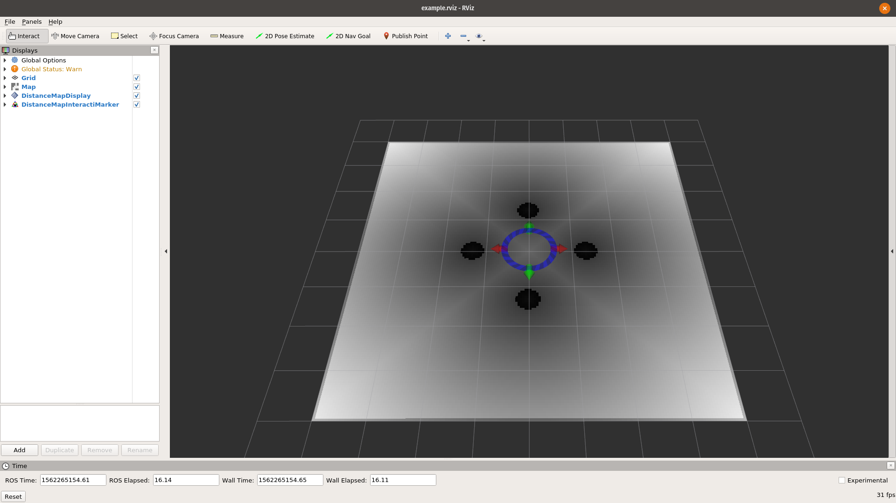

# distance_map

A package for converting `OccupancyGrid` to 2D distance map.

---

## Package Summary
The **distance_map** package provides a 2D Distance Map class
(see [Distance Transform](https://en.wikipedia.org/wiki/Distance_transform))
together with the means to generate it, convert it, send it and visualize it.

-   Maintainer status: maintained
-   Maintainer: Jeremie Deray <deray.jeremie@gmail.com>
-   Author: Jeremie Deray <deray.jeremie@gmail.com>
-   License: Apache-2.0
-   Bug / feature tracker: <https://github.com/artivis/distance_map/issues>
-   Source: git <https://github.com/artivis/distance_map.git> (branch: master)

<!-- [](https://travis-ci.org/artivis/distance_map) -->
---
<!-- ## Build Summary
| Indigo            | Jade              | Kinetic            | Lunar              |
|-------------------|-------------------|--------------------|--------------------|
| [![Indigo][1]][5] | [![Jade][2]][5]   | [![kinetic][3]][5] | [![lunar][4]][5]   |

[1]: https://travis-matrix-badges.herokuapp.com/repos/artivis/distance_map/branches/master/1
[2]: https://travis-matrix-badges.herokuapp.com/repos/artivis/distance_map/branches/master/4
[3]: https://travis-matrix-badges.herokuapp.com/repos/artivis/distance_map/branches/master/7
[4]: https://travis-matrix-badges.herokuapp.com/repos/artivis/distance_map/branches/master/10
[5]: https://travis-ci.org/artivis/distance_map

--- -->

<p align="center">
  <a href="#quick-start">Quick Start</a> •
  <a href="#quick-example">Quick Example</a> •
  <a href="#plugins">Plugins</a> •
  <a href="#contributing">Contributing</a>
</p>

---

## Quick Start

<!--
### Installation

#### Binaries
```terminal
$ apt-get install manif
```
-->
<!--#### From source-->

```terminal
$ git clone https://github.com/artivis/distance_map.git
$ catkin build distance_map
```

## Quick Example
Once all **distance_map** packages are built, one can run an example as follows,

```terminal
roslaunch distance_map_node example.launch
```

This command will :
-   start a [`map_server`](http://wiki.ros.org/map_server) providing a [simple map](distance_map_node/example/map/example.pgm)
-   start the **distance_map** node
-   start [`rviz`](http://wiki.ros.org/rviz)
-   start an interactive marker to introspect the **distance_map**

You should see the following window,



## Plugins
Available plugins:

-   [distance_map_opencv](https://github.com/artivis/distance_map/tree/master/distance_map_opencv) A plugin for [OpenCV distance map](https://docs.opencv.org/3.3.0/d7/d1b/group__imgproc__misc.html#ga8a0b7fdfcb7a13dde018988ba3a43042)
-   [distance_map_deadreck](https://github.com/artivis/distance_map/tree/master/distance_map_deadreck) A plugin for the [Dead Reckoning Distance Map](http://perso.ensta-paristech.fr/~manzaner/Download/IAD/Grevera_04.pdf)

Under development plugins:

-   None at this time.

<!-- ## Notes
-   This package is still under heavy developement thus the API is **not** completely stable yet.
-   For ROS distro pre-Kinetic, to properly visualize the `nav_msgs/Odometry` message published by the node with `Rviz` (that is, with its covariance), it is recommended to use the [rviz_plugin_covariance](https://github.com/laas/rviz_plugin_covariance) (E.g. [wiki Screenshot](https://github.com/artivis/distance_map/wiki/Screenshot)). -->

## Contributing

**distance_map** is developed according to Vincent Driessen's
[Gitflow Workflow](http://nvie.com/posts/a-successful-git-branching-model/).
This means,
-   the `master` branch is for releases only.
-   development is done on feature branches.
-   finished features are integrated via PullRequests into the branch `devel`.

For a PullRequest to get merged into `devel`, it must pass
-   Review by one of the maintainers.
    +   Are the changes introduced in scope of **distance_map**?
    +   Is the documentation updated?
    +   Are enough reasonable tests added?
    +   Will these changes break the API?
    +   Do the new changes follow the current style of naming?
-   Compile / Test / Run on all target environments.


## Credits

This work originated at [PAL Robotics](http://pal-robotics.com/en/home/), with
the participation of [Sai Kishor Kothakota](sai.kishor@pal-robotics.com)
